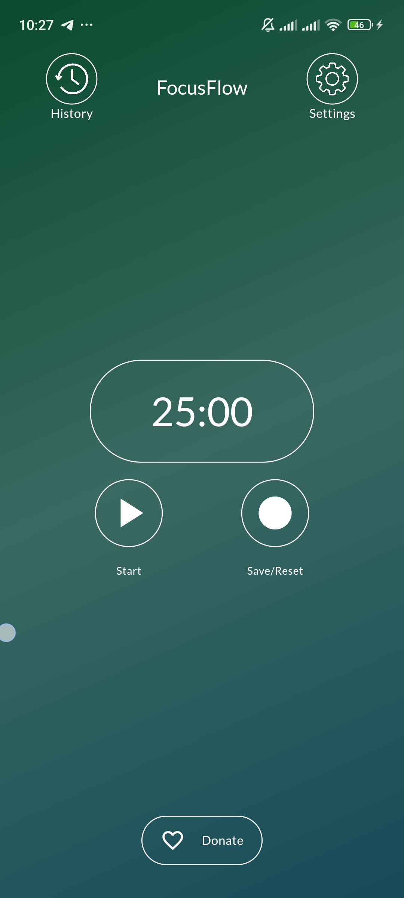
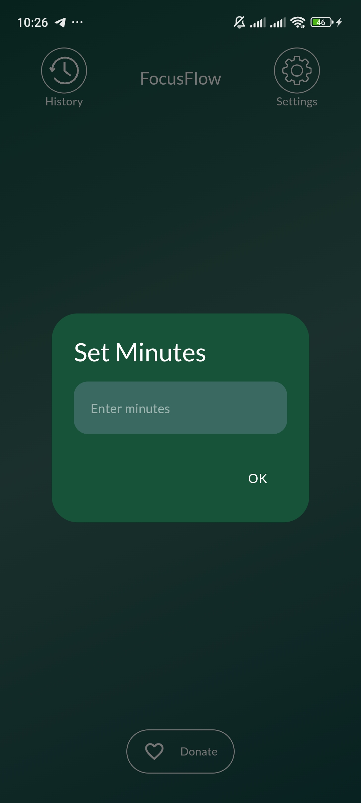
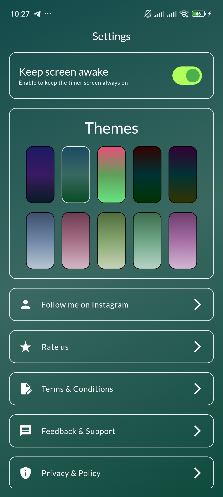
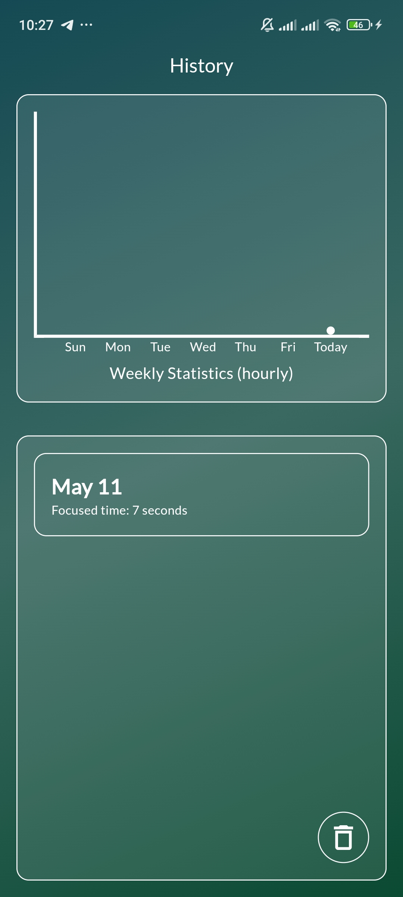

## About FocusFlow

FocusFlow is a productivity app designed to help users effectively manage their time using the Pomodoro Technique. This technique involves breaking work or study sessions into intervals, typically 25 minutes long, separated by short breaks. By incorporating the Pomodoro Technique into their routine, users can enhance their focus, productivity, and overall time management skills.

Key Features:
- **Pomodoro Timer**: FocusFlow provides a customizable timer for Pomodoro sessions, allowing users to set work intervals and breaks according to their preferences.

- **Intuitive Interface**: The app features a user-friendly interface that makes it easy to start, pause, or reset Pomodoro sessions with just a few taps.

- **Flexible Settings**: Users can personalize their Pomodoro experience by adjusting session duration, app themes, always-on mode, and more.

- **History & Statistics**: FocusFlow tracks users' Pomodoro sessions and provides detailed statistics and insights into their productivity habits. Users can view their work history, session completion rates, and productivity trends over time, empowering them to identify areas for improvement.

### Screenshots:

<div style="display: flex; justify-content: space-between;">
    <div style="flex: 1; margin-right: 10px;">
        
        <p style="text-align: center;">Pomodoro Timer</p>
    </div>
    <div style="flex: 1; margin-right: 10px;">
        
        <p style="text-align: center;">Set Time</p>
    </div>
    <div style="flex: 1; margin-right: 10px;">
        
        <p style="text-align: center;">Settings</p>
    </div>
    <div style="flex: 1;">
        
        <p style="text-align: center;">History & Statistics</p>
    </div>
</div>
### How to install
1. **Clone the github repo**
   ```
      https://github.com/developedbyamin/pomodoroapp.git
   ```
2. **Fetch and update the dependencies**
   ```
      flutter pub get
   ```
3. **Run**
   ```
      flutter run
   ```

You are free to customize the app according to your preferences and needs. Feel free to explore and modify the codebase to suit your workflow!
